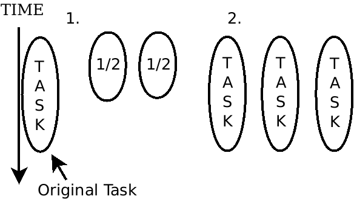

# C++ Concurrency in Action
by ANTHONY WILLIAMS

#### Suggested prior learning
- *RAII*
- rvalues and lvalues
- std:move

Books:
- The C++ Programming Language (First Chapter)

## Table Of Contents
[Chapter 1: Hello, world of concurrency in C++!](#chapter-1-hello-world-of-concurrency-in-c)
[Chapter 2: Managing Threads](#chapter-2-managing-threads)
[Chapter 3: Sharing Data Between Threads](#chapter-3-sharing-data-between-threads)

## Chapter 1: Hello, world of concurrency in C++!

- **C++11** Standard introduces support for multithreaded programs within the STL
- *Task Switching* provides the ILLUSION of concurrency
- *Hardware Concurrency* achieved with multiple processors or multiple cores
- *Context Switching* between tasks carries overhead
- Task Switching is used alongside Hardware Concurrency

#### Multiple Processes
- More overhead (starting a process, managing it, providing protection)
> NOTE: On Linux, a thread is a process that shares its memory
- Easier to write safe concurrent code (e.g. Erlang)
- Can use different machines over the network
- Communication is done through **signals, sockets, files, pipes, etc.**
- No support from the C++ standard for interprocess communication

#### Multiple Threads
- On some OS's: Threads are lightweight processes
- Shares address space, global vars, can pass pointers and references
- Careful consideration of communication between threads and sharing data
- View of data as seen from each thread must be consistent when accessed
- Favoured approach to concurrency in most languages

### When to use Concurrency?
**Two main reasons: SEPARATION OF CONCERNS and PERFORMANCE**

#### Separation of Concerns
- Group related code and separate unrelated code
- Avoid making calls to different, unrelated areas of code in a procedure
- Based on conceptual design, not increase of throughput
- Number of threads is independent of CPU cores (Task Switching)
- Logic in each thread is made simpler

#### Performance
1. Divide a single task into parts and run in parallel
   - *Task Parallelism*:
     Division in terms of processing, a task is divided in several steps
   - *Data Parallelism*:
     Each thread performs the same operation on different parts of data
   
   Algorithms which are prime candidates for parallelism: *Embarrassingly Parallel*
   Also known as: *Naturally Parallel*, *Conveniently Concurrent*
   They have good scalability
   Other algorithms may only be divided into a fixed number of parallel tasks
   
2. Process more data in the same amount of time
   - Make new features possible or enhance existing ones (e.g. higher video resolution)
   - Application of data parallelism
   - One chunk of data still takes the same time



> Additional Reading: The Free Lunch is Over, Sutter H.

### When not to use Concurrency?
**When the potential benefit is outweighed by cost or complexity**

- Code is harder to understand
- Intellectual cost
- Higher amount of bugs
- Potential gain should justify development time and costs
- Performance gain may not be huge due to overhead
- Threads are limited and can exhaust memory (specially in 32bit archs) [^1]
- Important to **adjust the number of threads**
- Concurrency is mostly worth using for performance critical parts, or clarity of design


#### History of C++ Multithreading
- C++98 lacks a definite memory model, so compiler extensions are needed to write multithreaded code.
- Boost library adds support for multithreading
- Problems due to no memory model with portability between platforms

#### C++11
- Thread aware memory model
- Classes to create and manage threads, protect shared data, synchronise threads and low level atomics
- Based on boost thread library

- What about efficiency?
  *Abstraction Penalty*: Penalty in performance for using high-level facilities vs low-level platform-specific directly
  Very low abstraction penalty on most platforms
  Atomic types replace assembly, platform-specific code
  More portable and easier to maintain
  Design of application is major factor in performance

- Platform specifics
  Types in the C++ thread library may offer `native_handle()` to use native implementation API directly


#### Hello World of Concurrency

```
#include <iostream>
#include <thread>

void hello()
{
  std::cout << "Hello World" << std::endl;
}

int main()
{
  std::thread t(hello); // starts thread
  t.join(); // wait for thread to finish
}
```


### Summary
- Concurrency, multithreading concepts
- When to/not to use concurrency?
- History of C++ support

[^1]: Thread pools may alleviate this

## Chapter 2: Managing Threads

- At least one thread in all programs (main)
- Starting a thread is constructing an `std::thread` object

```
#include <thread>
void do_some_work();

std::thread my_thread(do_some_work);
```

- `std::thread` works with any callable type, including function objects (functor)
  - In this case, the object is copied into the new thread
  - Don't pass functor directly, use double parentheses, brackets, or named variable
  ```
  class bg_task {...}
  std::thread t(bg_task()); // don't
  std::thread t((bg_task())); // okay
  std::thread t{bg_task()}; // okay
  ```
- Constructor also accepts a lambda expression
- **Can either wait for thread to finish (with `.join()`) or separate from it (with `.detach()`)**
- **Ensure data accessed by thread is valid as long as thread needs to access it**
- It is a bad idea to create a thread which accesses local variables and not wait for it to finish

### `.join()`

- Clears up storage and dissasociates thread with object, `.joinable()` will return false.
- Call to join may be skipped if an exception is thrown after the thread is created
- It is a good idea to use RAII to ensure the thread is joined before it goes out of scope

### `.detach()`

- The thread is no longer joinable
- Ownership will be passed to the C++ Runtime Library
- Also called *daemon* threads (as in UNIX)

#### Passing arguments to threads
- `std::thread t(f, args...);`
- Arguments are copied into the thread
- Be careful when passing a `char[]` that implicitly converts to `std::string` (or similar conversions)
  as conversion actually occurs in the new thread
- Passing references must be done by wrapping them in `std::ref(data)`

#### Member functions
```
X my_x;
std::thread t(&X::f, &my_x, args..);
```
> I believe `std::bind` may also be used

### Move semantics
- Remember to use `std::move` when necessary (e.g. `std::unique_ptr`) when passing arguments
- `std::thread` itself movable but cannot be copied
  `std::thread t2 = std::move(t1);`
  Will fail if object assigned to already has an associated thread.
- Ownership can be moved in and out of a function
- Can create a thread wrapper class that takes ownership of thread
- Allows to keep threads inside containers which are move aware such as `std::vector`


`std::thread::hardware_concurrency()`
- Provides a hint of how many threads can run truly concurrently

*Oversubscription*: more threads than the hardware naturally supports

### Unique Identifiers
- Each thread has a unique ID of type `std::thread::id`
- Retrieve with `get_id()` member function
  If the object has no associated thread, it returns a default constructed id
  For the current thread, call `std::this_thread::get_id()`
- Can be copied and compared (most comparison operators), also sorted
- Can be used as keys with `std::hash<std::thread::id>`
- Sometimes used to check if thread needs to behave differently
- Or used to store data for each thread in an associative container
- Can be output to console (implementation-dependant)

### Summary
- Threads: join, detach, passing arguments, move semantics
- Division of work, thread id's

## Chapter 3: Sharing Data Between Threads

- Need to have rules for which thread can access which bit of data when
  - and how updates in data are communicated to other relevant threads
- Incorrectly sharing data: one of the biggest causes of concurrency-related bugs
- Problems are created because of modifications
  - Read-only data is thread-safe
- Invariants in code may be broken during updates, specially if more than one value
  needs changing at once
  > Invariants are conditions that must be true for the correct operation of the program
  > or a class (*Class Invariants*)
- *Race Condition*: Outcome depends on relative ordering of execution of operations
  on two or more threads
  - There are problems when race conditions lead to broken invariants
  - C++ Standard defines *Data Race*:
    Race condition arising from concurrent modification to a single object
    Causes undefined behaviour
  - Hard to debug or duplicate
    - May disappear during debugging due to timing differences
  - How to avoid?
    a. Wrap data structures with protection mechanism that only allows one thread to see
      intermediate states when invariants are broken at a time
    b. Modify so any changes are done as one indivisible unit preserving invariants
      - Known as *Lock-Free Programming*
      - But difficult to get right
      - Must first understand nuances of memory model
    c. Handle as transaction (e.g. MySQL)
       - Known as *Software Transactional Memory (STM)*
       - But no direct support from in C++
  - Most basic mechanism for data protection in C++ standard is the **mutex**

### Mutexes
- Should mark all sensitive pieces of code as *mutually exclusive* (mutex) so only one thread
  can access it at any time, other threads have to wait for the first one to finish
- Before accessing shared data must *lock* the mutex associated with it, once done must *unlock* it
- Ensures all threads see a self-consistent view of all the shared data, and no broken invariants
- Most general of all available data-protection mechanisms in C++
- Caveats:
  - Protect the right data
  - Avoid inherent race conditions
  - Avoid deadlock
  - Avoid protecting either too much (inefficient) or too little (risk of data race) data

#### Using mutexes in C++
- Create by constructing instance of `std::mutex`
- Lock with `.lock()`, unlock with `.unlock()`
  - Not recommended to call directly since thread may throw exceptions before unlocking mutex
- `std::lock_guard` implements a *RAII*-style wrapper for a mutex to unlock it upon its destruction
- Destroying an `std::mutex` before unlocking it is undefined behaviour
- Mutexes are declared in `<mutex>` header

```
#include <mutex>
std::mutex some_mutex;

void exclusive_operation_a()
{
  std::lock_guard<std::mutex> guard(some_mutex);
  // Exclusive access to some data structure
}

void exclusive_operation_b()
{
  std::lock_guard<std::mutex> guard(some_mutex);
  // Only one thread can hold the lock at any given moment
}
```

- Common to group mutex and protected data structure in a class rather than as globals
  - Member functions lock mutex before accessing sensitive data members, then unlock once done
- This protection may be undermined if functions return a pointer or a reference to the protected data
  - Data then could be changed externally without first acquiring the mutex
  - Must ensure no 'backdoors' exist
  - User supplied functions can also bypass protection
- Don't pass pointers and references to protected data outside the scope of the lock, either by:
  - Returning them from a function
  - Storing them in externally visible memry
  - Passing them as arguments to user supplied functions

- Beware of race conditions that are inherent to a particular interface or data structure
  - e.g. The `.empty()` member function of a stack cannot be relied on since another thread
    may change the stack's state right after but before doing anything with that information
  - e.g. On a stack, the `.top()` and `.pop()` operations may be subject to a data race
    ```
    // thread 1
    int v = s.top();
    // thread 2
    int v = s.top();
    // thread 1
    s.pop();
    // thread 2
    s.pop();

    // The v variables in both threads have the same value, while
    // the next value has been deleted and not stored
    ```

    - Solution is to combine these two calls into a single one
    - However, this has a problem:
      - Copy constructor of type T may throw an exception (when returning from an operation)
        so the value that has just been popped would be lost
      - Part of why `std::stack` separates these two calls
      Some solutions:
        1. Passing a reference to receive the popped value
	  ```
	  std::vector<int> result;
	  some_stack.pop(result); // by reference
	  ```
	  - May be expensive to construct an instance
	  - May not be possible if constructor needs information not available at that time
	  - Requires stored type to be assignable
	2. Require a *no-throw* copy or move contsructor
	  The presence of a *no-throw* copy or move constructor can be detected
	  at compile time to restrict the stack (or data structure) to such types
	  ```
	  std::is_nothrow_copy_constructible
	  std::is_nothrow_move_constructible
	  ```
	  - Quite restrictive, as there are many more types with copy constructors that can throw
	    and no move constructors than those with *no-throw* copy or move constructors
	3. Return a pointer to the item
	  - Pointers can be freely copied without throwing
	  - Requires means of managing the memory allocated to the object which may exceed cost
	    of returning by value in some cases (e.g. int)
	  - `std::shared_ptr` is a good choice for pointer
	    - Avoids leaks, avoids calling new and delete, and full control of memory allocation
	4. Provide 1 and either 2 or 3
	  - More user freedom
	```
	void push(T new_value)
	{
          std::lock_guard<std::mutex> lock(m);
	  data.push(new_value);
	}

	std::shared_ptr<T> pop()
	{
          std::lock_guard<std::mutex> lock(m);
	  if (data.empty()) throw empty_stack();
	  std::shared_ptr<T> const res(std::make_shared<T>(data.top()));
	  data.pop();
	  return res;
	}
	```
        > Additional Reading: *Exceptional C++: 47 Engineering Puzzles, Programming Problems, and Solutions*, Sutter H.
        > Additional Reading: *Exception Handling: A False Sense of Security*, Cargill T.
	- Locking at too small a granularity may give rise to race conditions
	- Locking at too large a granularity may eliminate any performance gains from concurrency
	  - Linux used to have a singe global kernel lock
	- One issue with fine-grained locks is that more than one mutex may be necessary
	  - May produce another problem: *deadlock*
	    - Rather than a race condition, two (or more threads) are waiting for each other, so none make any progress

### Deadlock
- Each of a pair of threads is waiting on a lock that the other thread holds
- Neither can continue, for they are waiting for the other to release theirs first
- Biggest problem when locking two or more mutexes
- Common advice: **Always lock the mutexes in the same order**
  - If you always lock A before B, deadlock will not happen
  - Sometimes not so simple
    - e.g. when the locks guard a separate instance of the class
      - Both instances might try to lock their own mutex before the others causing deadlock
    - `std::lock`
      - Locks two or more mutexes at once without risk of deadlock
      ```
      friend void swap(X& lhs, X& rhs)
      {
        if (&lhs == &rhs) return;
	std::lock(lhs.m, rhs.m);
	std::lock_guard<std::mutex> lock(lhs.m, std::adopt_lock);
	std::lock_guard<std::mutex> lock(rhs.m, std::adopt_lock);
	swap(lhs.detail, rhs.detail);
      }
      ```
      - Attempting to reacquire a lock on a mutex that is already held in the same thread is undefined behaviour
        - `std::recursive_lock` allows reentrant locks
      - `std::adopt_lock` is used to indicate to the `std::lock_guard` objects that the mutex is already locked
      - `std::lock` is all-or-nothing with regard to locking in case of exceptions
      - Doesn't help if locks are acquired separately

- Deadock can ocurr without locks, e.g. two threads call `.join()` on each other
- Don't wait for another thread if its possible it's waiting for you
- Avoid nested locks
  - Don't acquire a lock if already holding one
  - Use `std::lock` to acquire multiple locks
- Avoid calling user-supplied code while holding a lock
  - User supplied code might acquire another lock
  - Sometimes unavoidable
- Acquire locks in fixed order
  - If not possible to use `std::lock`, next best thing is to acquire them in the same order in every thread
  - For this, use a lock hierarchy
    - One way of defining lock ordering
    - Assign each lock a numerical value
      - Thread can only lock a mutex if it doesn't already hold a lock from a lower number or layer
      - Can't hold two locks with the same hierarchy
      - Not part of STL but easy to implement
        - Can be used with `std::lock_guard` by implementing members `lock()`, `unlock()`, and `try_lock()`
	- `try_lock()`: if the lock is currently held by another thread return false and don't wait
	  - May be used by `std::lock()` internally
    - Detection in runtime but not timing dependent
    - Change in application design may eliminate causes of deadlock in the first place
- Guidelines apply beyond locks
  - Avoid waiting for a thread while holding a lock
  - Might be worth using a thread hierarchy
  - Join them in the same function they are started
- `std::unique_lock`
  - Very similar to `std::lock_guard` and also implements *RAII*
  - Doesn't always own mutex - relaxed invariants
  - Can pass `std::defer_lock` as second argument to acquire lock later, not when constructing
  - Can call `lock()` on `std::unique_lock` (not mutex), or pass to `std::lock`
  - Uses more space and slightly slower than counterpart
  ```
  std::unique_lock<std::mutex> lock(m, std::defer_lock);
  lock.lock();
  ```
  - Mutex can be transferred between instances by moving them around (implicit or using `std::move`)
  - Movable but not copyable
  - Can be unlocked with `unlock()`
    - Can be important for performance to not hold lock for entire scope
- If multiple threads wait on the same resource, any thread holding the lock for longer than necessary
  will increase the total time spent waiting
- Only lock mutex when accessing shared data, process data outside the lock
- `std::unique_lock` works well for this scenario
- Only hold for minimum possible time to perform required operations (but beware race conditions)

> C++17 introduced `std::scoped_lock`, which combines `std::lock_guard` and `std::lock` into one

### Alternative facilities for protecting shared data
- There are alternatives to mutexes suitable for other specific scenarios

1. Protecting during initialisation only
  - Locking a mutex after data has been initialised may be pointess and a performance hit
  - Imagine a shared resource expensive to construct that should only be done if required: *Lazy Initialisation*
  - Threads are serialised if the wait on the mutex to check if resource has been initialised
    - Double-checked locking pattern:
      - Only lock mutex if pointer to resource is null
      - Then, check again after locking
      - Problems present due to language semantics which may lead to one thread seeing pointer but object only partially constructed
      ```
      if (!resource_ptr)
      {
        std::lock_guard<std::mutex> lk(resource_mutex);
	if (!resource_ptr)
	{
          resource_ptr.reset(new some_resource);
	}
      }
      resource_ptr->do_something(); // here resource may be only partially constructed - undefined behaviour
      ```
      - Solutions:
        - `std::once_flag` and `std::call_once`
	  ```
	  std::shared_ptr<some_resource> resource_ptr;
	  std::once_flag resource_flag;

	  void init_resource()...
	  void foo()
	  {
            std::call_once(resource_flag, init_resource);
	    resource_ptr->do_something();
	  }
	  ```
	  Can also initialise class members
	  ```
	  std::call_once(resource_flag, &X::init_resource, this);
	  - `std::once_flag` can't be copied or moved
	  ```
	- local static variable
	  - Local variable declared with static is guaranteed by the standard to only be constructed on one thread (C++11 and above)
	  ```
	  class my_class;
	  my_class& get_instance()
	  {
            static my_class instance; // thread-safe
	    return instance;
	  }
	  ```
2. Rarely updated data structures
- Some structures, such as cache of DNS entries may not be updated for a very long time - sometimes years
- Using a mutex for these is overly pessimistic, since it prevents concurrency in reading the data
- *reader-writer* mutex allows exclusive access by a single *writer* thread or shared concurrent access
  by multiple *reader* threads
- C++11 doesn't provide it out of the box, but possible to use `boost::shared_mutex`
> `std::shared_mutex` was introduced in C++17
  - For the update operations use `std::lock_guard` and/or `std::unique_lock`
  - For read-only access, use `std::shared_lock` for shared access
  - If any thread has an exclusive lock, no other thread may acquire until the first thread has given up their lock

3. Recursive locking
- Sometimes it is desirable to reacquire the same mutex multiple times without releasing it first
- C++ standard implements `std::recursive_mutex`
  - Must release all locks before it can be locked by another thread
- Worth considering changing the design itself instead
  - e.g. Instead of having function A call B, have private function C which can be called
    by both A and B and it can work with broken invariants, without locking the mutex (should already be locked)

### Summary
- Race conditions
- Mutexes
- Deadlock
  - Avoiding deadlock
    - `std::lock`
  - Granularity for locking
  - `std::call_once`
  - `std::shared_mutex`
